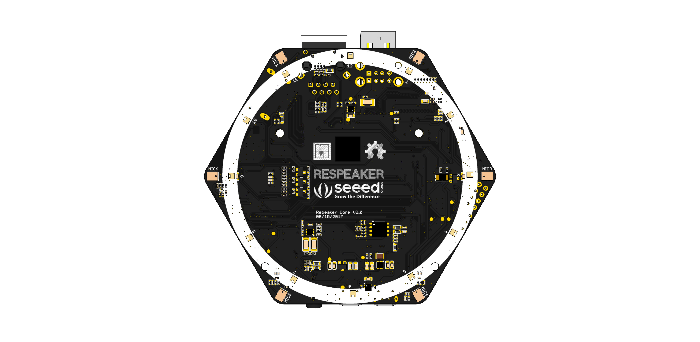

## ReSpeaker Core V2 wiki

Now we have an new device, called **ReSpeaker Core V2**, with more powerful CPU, large eMMC and on-board 8channels microphone array.
Click here to [Getting started with ReSpeaker Core V2](/docs/ReSpeaker_Core_V2/README.md).

## ReSpeaker wiki

ReSpeaker is an open modular voice interface to hack things around you. Let you interact with your home appliances, your plant, your office, your internet-equipped devices or any other things in your daily life, all by your voice. Click here to [Getting Started with ReSpeaker](/docs/ReSpeaker/README.md).
